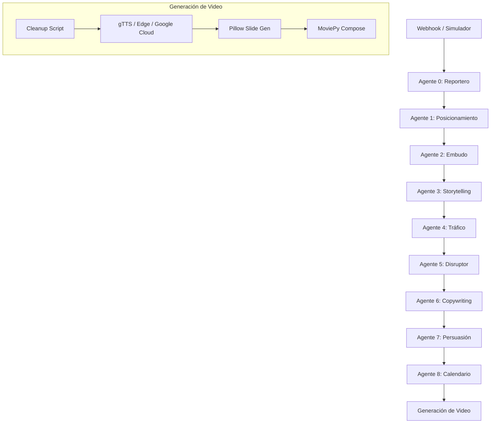

# Arquitectura Técnica: Motor de Marketing TINITA HEALTH

Este documento detalla el flujo de trabajo automatizado para la creación de activos de marketing de los 82 productos.

## 🔄 Pipeline de Generación (10 Fases)

El sistema utiliza una arquitectura de agentes encadenados donde el output de uno es el input del siguiente.



## 🏗️ Infraestructura

### VPS (sts@148.230.88.220)
- **n8n**: Orquestador principal de los 9 agentes.
- **Docker**: Contenedores aislados para n8n, Odoo y Clínica.
- **OpenRouter**: Gateway para acceso a modelos LLM (Gemini, Claude, Llama).

### Entorno Local
- **.venv_marketing**: Entorno Python aislado con `moviepy`, `Pillow`, `edge-tts`.
- **Scripts de Scratch**: Herramientas para simulación y renderizado local.

## 📂 Organización de Datos

```
Repositorio/
├── .agents/skills/      # Inteligencia de los agentes (prompts/reglas)
├── {Producto}/          # Carpeta por cada uno de los 82 productos
│   ├── README.md        # Estado y ficha del producto
│   └── n8n_output/      # Activos generados (Markdown, MP3, MP4)
└── scratch/             # Scripts de ejecución
```

## 🛡️ Control de Calidad
Cada ejecución es validada por el skill `quality-checker` que asegura:
1. **Ratio 3:1** de Gary Vee en el calendario.
2. **Niveles de Conciencia** de Schwartz en los copies.
3. **Coherencia del Avatar** en todas las piezas.

---
*Documento generado automáticamente por el Agente de Documentación.*
